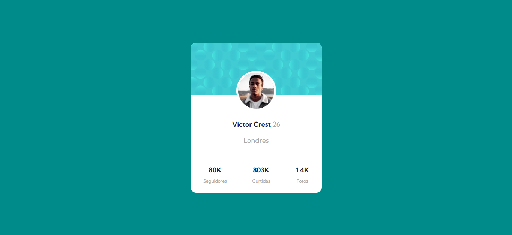
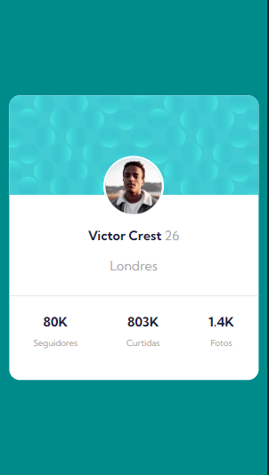

# Desafio de Profile Card - Frontend-Mentor

Este é um desafio de Profile Card proposto pelo site Frontend-Mentor.

## Tabela de Conteúdos

- [Visão Geral](#visão-geral)
    - [Imagens](#imagens)
    - [Link da página](#link)
- [Processo](#processo)
    - [Linguagens utilizadas](#linguagens-utilizadas)
    - [O que aprendi](#o-que-aprendi)
    - [Possíveis evoluções](#possíveis-evoluções)
- [Autor](#autor)

## Visão-geral

### Imagens

<br>

````
Versão de Desktop
````

  

<br>

````
Versão Mobile
````

 <br> <br>

### Link

- Página no GitHub Pages: <a href="https://julio-mansan2.github.io/card-profile/">Clique aqui!</a>

## Processo

### Linguagens utilizadas

<br>

- Marcações semânticas de HTML5
- Propriedades de customização do CSS3

<br>

### O que aprendi

<br>

- Utilizar a tag "hr"

````html

<hr>

````

<br>

- Algumas propriedades de flexbox

````css

    display: flex;
    align-items: center;
    align-content: center;
    justify-content: space-around;

````
<br>

- Propriedades de responsivo utilizando media-queries

````css
@media (max-width: 375px) {

    
    body {
        font-size: 14px;
    }
    
    .container {
        height: 100%;
        display: flex;
        align-items: center;
        justify-content: center;
        position: absolute;
        margin: auto;
        top: 0;
        bottom: 0;
        left: 0;
        right: 0;
    }
    

    
    .cartao-corpo {
        width: 330px;
        height: 330px;
        border-radius: 10px;
    
    }
    
    .imagem-do-topo {
        width: 330px;
        border-radius: 10px 10px 0px 0px;
    }

    .foto-de-perfil {
        width: 85px;
        height: 85px;
        border: 3px solid #fff;
        top: 60px;
    }

    .cidade {
        margin: 5px
    
    }

    .informacoes {
        position: relative;
        bottom: 60px;
        
    }

    
    .foto-de-perfil {
        width: 85px;
        height: 85px;
        border: 3px solid #fff;
        margin: 5px;
    }

    .principal,.cidade {

       margin: 10px;

    }

 

}

````
<br>

### Possíveis evoluções

<br>

- Aprimorar o uso do display flex;
- Abdicar na medida certa de posicionamentos manuais;
- Melhorar a centralização de elementos;
- Configurar o background;
- Códigos mais compactos.

<br>

## Autor

GitHub - <a href="https://github.com/julio-mansan2">julio-mansan2</a> <br>
Front-end Mentor - <a href="https://www.frontendmentor.io/profile/julio-mansan2">julio-mansan2</a> <br>